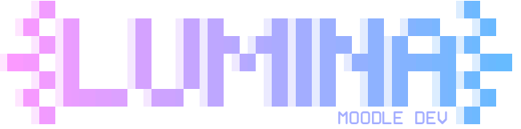

# Lumina Moodle Developer 🎓🤖

<p align="center">
    
</p>

> **Turn your AI assistant into a Moodle expert.**

> MCP server that connects AI assistants (Claude, Gemini and others) directly to Moodle's internal structure to accelerate plugin development.

<p align="center">

[](https://www.npmjs.com/package/lumina-mdle-dev)
[](https://www.npmjs.com/package/lumina-mdle-dev)
[](https://nodejs.org)
[](./LICENSE)
[](https://modelcontextprotocol.io)
[](./CONTRIBUINDO.md)

</p>

🇧🇷 [Leia em Português](./LEIAME.md) | 📚 [Full Documentation](./docs/en/index.md)

---

## 📑 Index

- [What is it](#-what-is-lumina-moodle-developer)
- [Why use it](#-why-use)
- [Use cases](#-use-cases)
- [Quick example](#-quick-example)
- [Simplified architecture](#-simplified-architecture)
- [Project status](#-project-status)
- [Requirements](#-requirements)
- [Compatible MCP clients](#-compatible-mcp-clients)
- [Installation](#-installation)
- [MCP client configuration](#️-mcp-client-configuration)
- [Available resources](#-available-resources)
- [Security](#-security)
- [Documentation](#-documentation)
- [Contributing](#-contributing)
- [Author](#-author)
- [License](#-license)

---

## 🚀 What is Lumina Moodle Developer?

**Lumina Moodle Developer** connects your local Moodle installation to AI assistants using the **Model Context Protocol (MCP)**.

Instead of relying only on the AI's generic knowledge about Moodle, the server automatically exposes the real structure of your installation, including:

- **Core APIs:** native Moodle functions, classes and libraries.
- **Installed plugins:** complete mapping of `local`, `mod`, `auth`, `block` and other types.
- **Database:** table structure and field definitions.
- **Ecosystem:** events, Hooks (Moodle 4.3+), Tasks and Capabilities.

---

## ✨ Why use it?

### 🧠 Real code awareness

The AI starts to know **your installation**, not a generic Moodle. It automatically detects the Moodle version in use, the plugins already installed and how the database tables are structured — and uses this context when generating or reviewing code.

### ⚡ Zero configuration in Moodle

Unlike Web Services, you do not need to configure tokens, create service users or expose APIs. The server reads **directly from local filesystem files**.

### 🔁 Natural integration in the development workflow

Commands in natural language in the AI chat are translated into concrete actions: creating plugins, auditing code, querying the database and much more — without leaving your editor.

---

## 💡 Use cases

| Scenario           | What you do                            | What the server delivers                                             |
| ------------------ | -------------------------------------- | -------------------------------------------------------------------- |
| **New plugin**     | Ask to create a plugin of type `local` | Complete structure with `version.php`, `lang/`, `db/` and base files |
| **Security audit** | Request review of an existing plugin   | Analysis focused on real Moodle conventions and APIs                 |
| **Database query** | Ask about the structure of a table     | Returns the real `install.xml` definition from your installation     |
| **Onboarding**     | Ask for an environment map             | Complete report of version, plugins and available capabilities       |

---

## ⚡ Quick example

After configuring the server, you can give commands in natural language in the AI chat:

```

// 1. Initialize the Moodle context
"Map my Moodle environment and give me a summary."

// 2. Create a plugin
"Create a local plugin called 'minhas_ferramentas' with capability support."

// 3. Audit code
"Review the plugin local_minhas_ferramentas focusing on security."

```

> For a complete list of commands, see the [Tools Reference](./docs/en/reference/tools.md).

---

## 🏗️ Simplified architecture

```

AI Assistant (Claude, Gemini...)
│
│  Model Context Protocol (MCP)
▼
┌─────────────────────────┐
│      lumina-mdle-dev     │
│  ┌───────────────────┐  │
│  │    Tools          │  │  ← Actions: scaffold, audit, API search...
│  │    Resources      │  │  ← Context: structure, plugins, DB
│  │    Prompts        │  │  ← Ready-to-use templates
│  └───────────────────┘  │
└──────────┬──────────────┘
│  Reading PHP files + writing context .md files
▼
Local Moodle installation
/var/www/moodle (or equivalent)

```

The server **never communicates with external servers** and **never modifies Moodle PHP files**. All analysis is performed locally. The only files written are context `.md` files generated inside plugin directories.

---

## 📊 Project status

> **v1.0.0:** initial release.

### Available Tools

| Tool                      | Description                                                                   | Status       |
| ------------------------- | ----------------------------------------------------------------------------- | ------------ |
| `init_moodle_context`     | Initializes the complete context of the Moodle installation                   | ✅ Available |
| `generate_plugin_context` | Generates the complete AI context for a specific plugin                       | ✅ Available |
| `plugin_batch`            | Generates or updates context for multiple plugins at once                     | ✅ Available |
| `update_indexes`          | Regenerates global indexes (with intelligent cache by mtime)                  | ✅ Available |
| `watch_plugins`           | Monitors plugins and updates context automatically on save                    | ✅ Available |
| `search_plugins`          | Searches installed plugins by name, component or type                         | ✅ Available |
| `search_api`              | Searches Moodle core API functions by name and visibility                     | ✅ Available |
| `get_plugin_info`         | Loads the complete context of a plugin into the AI session                    | ✅ Available |
| `list_dev_plugins`        | Lists all plugins marked as in development                                    | ✅ Available |
| `doctor`                  | Diagnoses the environment: Node.js, Moodle, indexes and cache                 | ✅ Available |
| `explain_plugin`          | Explains the architecture of a plugin, by section or complete                 | ✅ Available |
| `release_plugin`          | Packages a plugin into a versioned ZIP file ready for distribution            | ✅ Available |

For full details of parameters and examples, see the [Tools Reference](./docs/en/reference/tools.md).

---

## 📋 Requirements

| Component        | Minimum version | Notes                              |
| ---------------- | --------------- | ---------------------------------- |
| Node.js          | 18.x            | LTS recommended                    |
| Moodle           | 4.1             | Hook API requires Moodle 4.3+      |
| Operating system | Any             | Linux, macOS and Windows supported |

> The Docker environment is optional. Any local Moodle installation accessible via the filesystem works.

---

## 🔌 Compatible MCP clients

| Client             | Support     | Configuration guide                                          | Tested |
| ------------------ | ----------- | ------------------------------------------------------------ | ------ |
| Claude Code        | ✅ Official | [View guide](./docs/en/guides/clients/claude-code.md)        | Yes    |
| Antigravity CLI    | ✅ Official | [View guide](./docs/en/guides/clients/antigravity.md)        | Yes    |
| OpenAI Codex       | ✅ Official | [View guide](./docs/en/guides/clients/codex.md)              | No     |
| OpenCode           | ✅ Official | [View guide](./docs/en/guides/clients/opencode.md)           | Yes    |

> Other MCP clients compatible with the `stdio` protocol should work, but are not officially tested.

---

## 🛠️ Installation

### Via NPM (recommended)

```bash
npm install -g lumina-mdle-dev
```

### Via repository (development)

```bash
git clone https://github.com/kaduvelasco/lumina-mdle-dev.git
cd lumina-mdle-dev
chmod +x setup.sh
./setup.sh
```

---

## ⚙️ MCP client configuration

The server requires the environment variable `MOODLE_PATH` pointing to the root of your Moodle installation.

### Claude Code

```bash
claude mcp add lumina-mdle-dev \
  -e MOODLE_PATH=/your/moodle/path \
  -- npx -y lumina-mdle-dev
```

### Antigravity CLI

Edit or create `~/.gemini/antigravity/mcp_config.json` and add the server under the `mcpServers` block:

```json
{
    "mcpServers": {
        "lumina-mdle-dev": {
            "command": "npx",
            "args": ["-y", "lumina-mdle-dev"],
            "env": {
                "MOODLE_PATH": "/your/moodle/path"
            }
        }
    }
}
```

> For detailed instructions for each client, including PATH configuration for version managers (nvm, mise, asdf), see the [Client Guides](./docs/en/guides/clients/).

---

## 📦 Available resources

The server implements the three primitives of the MCP protocol:

### 🔧 Tools

Actions executable by the AI: create plugins, audit code, query the database and map the environment. → [Full reference](./docs/en/reference/tools.md)

### 📄 Resources

Structured context exposed to the AI: directory structure, plugin list, database schema and core metadata. → [Full reference](./docs/en/reference/resources.md)

### 💬 Prompts

Pre-configured prompt templates for common Moodle development tasks. → [Full reference](./docs/en/reference/prompts.md)

---

## 🔒 Security

- The server operates **exclusively on the local filesystem** — no network port is opened in default mode and no data is sent to external servers.
- The server **never modifies Moodle PHP files**. Writing is limited to context `.md` files generated inside plugin directories.
- It is recommended to use the server only in **development environments**, never in production instances.
- The `MOODLE_PATH` variable must point only to local and isolated installations.
- **HTTP mode (`--http`):** when a `--token` is provided, authentication uses constant-time comparison to prevent timing attacks. The token must be sent via the `Authorization: Bearer <token>` header — query parameter is not accepted.

---

## 📚 Documentation

Full documentation is available in `docs/`:

- 👉 [Quick start](./docs/en/getting-started/quickstart.md)
- 👉 [Creating your first plugin](./docs/en/getting-started/first-plugin.md)
- 👉 [Tools Reference](./docs/en/reference/tools.md)
- 👉 [Resources Reference](./docs/en/reference/resources.md)
- 👉 [Prompts Reference](./docs/en/reference/prompts.md)
- 👉 [Troubleshooting](./docs/en/troubleshooting/common-issues.md)

---

## 🛠️ Useful tools

Other projects by the same author that complement the development environment:

- [Lumina Tools](https://github.com/kaduvelasco/lumina-tools) — A unified Go binary with a rich TUI for Linux administration and development workflows.
- [Lumina Vault](https://github.com/kaduvelasco/lumina-vault) — A high-performance Model Context Protocol (MCP) server that acts as a structured, persistent memory for AI assistants during software development.

---

## 🤝 Contributing

Contributions are welcome! See the [Contribution Guide](./CONTRIBUINDO.md) to learn how to report bugs, suggest improvements or submit pull requests.

---

## 👤 Author

**Kadu Velasco**

- GitHub: [@kaduvelasco](https://github.com/kaduvelasco)

---

## 📄 License

Distributed under the **GPL-3.0** license. See the [LICENSE](./LICENSE) file for more details.
